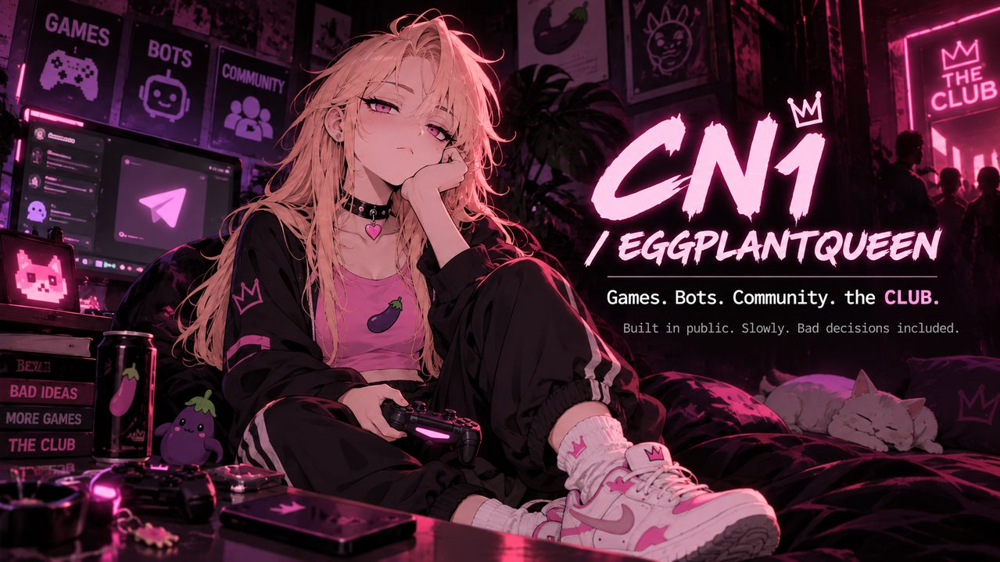

  

# CN1 / EggplantQueen

**An internet-native character becoming an ecosystem.**

Games. Bots. Community. Multiplayer experiments. **the CLUB.**

Built in public. Slowly. Bad decisions included.

[**STATUS**](STATUS.md) · [**ROADMAP**](ROADMAP.md) · [**VISUAL GUIDE**](BRAND.md) · [**WEBSITE**](https://eggplantqueen.lol) · [**TELEGRAM**](https://t.me/CN1_EggplantQueen) · [**X**](https://x.com/CN1Eggplant)

---

## What is CN1?

CN1 / EggplantQueen is an independent internet-native project built around one character and a growing set of connected experiences.

It started small. It did not stay small.

Today the project spans community tools, Telegram bots, games, multiplayer experiments, social spaces and an evolving 3D version of CN1.

The idea is simple: **build real things, connect them together, and let the project develop in public without pretending to be a giant company.**

No fake promises.  
No fake hype.  
Just CN1.

## The ecosystem

| Project | What it is | Status |
| --- | --- | --- |
| **CN1** | The character and identity at the center of the ecosystem | Active |
| **EggplantQueenBot** | Telegram-native CN1 interaction, community and utility bot | Live |
| **Eggplant Slots** | CN1 game built around XP, risk and bad decisions | Active project |
| **CN1: BAD DECISIONS** | Arcade experiment | Experimental |
| **Lower Rooms** | CN1 combat / multiplayer universe | In development |
| **the CLUB** | Online social, music and community space | Live / evolving |
| **3D CN1** | Reusable character for games, the CLUB, content and future experiences | In development |

Some experiments survive.

Some get rebuilt.

Some probably deserved to die earlier.

## CN1 herself

CN1 is not a mascot pasted on top of unrelated products.

She is the common thread.

The character, visual identity, attitude, games, bots and spaces are designed to feel like parts of the same strange little internet universe.

Expect deadpan reactions, pink eyes, questionable decisions and an unreasonable amount of eggplant-related infrastructure.

→ [Public visual guide](BRAND.md)

## What is being built now?

Current focus includes:

- expanding the public CN1 identity and project presentation;
- building the reusable **3D CN1** foundation;
- improving **Lower Rooms** combat and multiplayer behavior;
- expanding **the CLUB**;
- continuing Telegram/community tooling;
- turning actual development progress into public content instead of manufactured hype.

→ [See current status](STATUS.md)  
→ [See the public roadmap](ROADMAP.md)

## Built in public — not open source

This repository is the **public presentation home** of CN1.

It is intentionally **not** the production source-code repository.

Private application code, infrastructure, credentials, internal architecture, databases and operational material are not published here.

What belongs here:

- project presentation;
- roadmap and status;
- public documentation;
- screenshots and media;
- selected public assets;
- community-facing updates.

## Links

- **Website:** https://eggplantqueen.lol
- **X:** https://x.com/CN1Eggplant
- **Telegram community:** https://t.me/CN1_EggplantQueen
- **Official Telegram channel:** https://t.me/CN1EggplantQueen
- **CN1 bot:** https://t.me/EggplantQueenBot

---

**CN1 is being built.**

That is the roadmap in its most accurate form.
